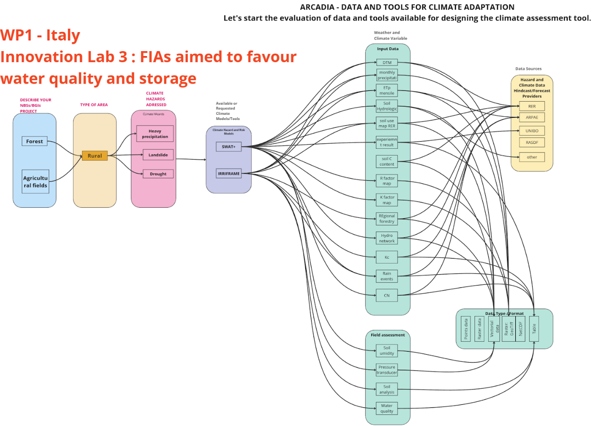

# Risk Assessment Methodology

The ARCADIA Assessment Toolkit provides a structured, practice-oriented methodology for conducting **regional Climate Risk Assessments (CRA)** that can directly support the selection, design and evaluation of **Nature-based Solutions (NbS)** and **Blue–Green Infrastructure (BGI)**. Consistent with widely adopted CRA practice, climate risk is framed as the interaction between **Hazard, Exposure and Vulnerability**. The distinctive operational feature of the ARCADIA approach is that workflows are designed to support a controlled comparison between a **baseline** configuration and an **NbS (adaptation) scenario**, so that changes in indicators can be attributed to the intervention under comparable boundary conditions.

In line with the CLIMAAX Handbook and common CRA practice, we started from the usual **Hazard–Exposure–Vulnerability** logic as the conceptual backbone of risk assessment, consistent with the **IPCC risk framework** (see [https://www.ipcc.ch/](https://www.ipcc.ch/) and the IPCC AR6 WGII report [https://www.ipcc.ch/report/ar6/wg2/](https://www.ipcc.ch/report/ar6/wg2/)). Hazard assessment describes the probability/intensity of climate-driven events or stressors (e.g., extreme rainfall, heat stress, drought conditions) and how they vary in space and time. Exposure assessment identifies the people, assets, ecosystems and services potentially affected, while vulnerability assessment characterizes their sensitivity and adaptive capacity (including biophysical and socio-economic factors), determining how exposed elements translate hazard into impacts. In operational terms, “risk” emerges from the combination of these components and is typically expressed through indicators (maps, time series, or impact proxies) that support prioritization and decision-making.

This conceptual basis is also reflected in the **CLIMAAX qualitative and quantitative CRA approach** (see [https://www.climaax.eu/](https://www.climaax.eu/) and the handbook/toolbox pages at [https://handbook.climaax.eu/](https://handbook.climaax.eu/) and [https://www.climaax.eu/handbook/toolbox/](https://www.climaax.eu/handbook/toolbox/)).

The ARCADIA Assessment Toolkit **moves from this general framing,** but translates it into harmonized, executable workflows so that regions can move from conceptual CRA components to reproducible procedures and scenario-based evaluation of NbS/BGI performance. **To foster replicability** across different hazards and contexts, the methodology is organized, in a **tutorial style fashion**, as a harmonized four-step workflow that remains stable even when specific datasets and tools differ across regions:

> **Step 1 — Data acquisition and preparation.** Users identify and prepare the minimum dataset needed to characterize hazard, exposure and vulnerability for the case at hand. This includes harmonising spatial reference, resolution and time coverage, and documenting assumptions and metadata. Workflows are designed to use **local high-resolution data** where available (to reflect regional monitoring and planning practice), while also pointing to **interoperable/open European sources** to improve transferability when local datasets are limited.
>
> **Step 2 — Model or analysis setup (and basic verification).** Users configure the chosen analysis chain—ranging from process-based models to indicator-based spatial procedures—defining the spatial domain, parameters and boundary conditions required to generate outputs and indicators. Where possible, the workflow includes basic verification steps (e.g., consistency checks against known patterns or past events) to ensure that the configured setup is plausible for the local context before running scenario comparisons.
>
> **Step 3 —Analysis and risk-relevant indicators.** The workflow is executed for the baseline (“business-as-usual”) configuration to quantify hazard metrics and/or risk-relevant indicators, producing a reference picture of where risks and impacts concentrate and which drivers are most critical. Indicators **may represent risk metrics or robust risk-related proxies** depending on data availability and workflow scope.
>
> **Step 4 — NbS scenario testing.** The NbS is represented as an explicit scenario change within the same workflow (e.g., land cover/management changes, retention–infiltration features, parameter updates consistent with the intervention). The workflow is re-run under the same analysis settings, and indicators are compared against the baseline to quantify the expected performance of the NbS/BGI option(s), including potential trade-offs where relevant.

By following this methodology, users can identify which climate risks are most critical in their region, establish a robust baseline for planning, and assess how NbS/BGI scenarios modify risk-relevant indicators in a transparent and reproducible way.

The resulting Toolkit is a **harmonised set of replicable CRA workflows**, not a single software product.

##

## Climate Risk Assessment Framework

The Climate Risk Assessment (CRA) framework is applied across ARCADIA through a **shared, stepwise logic** (hazard → exposure/sensitivity → risk characterisation → option appraisal), while keeping the implementation flexible enough to reflect region-specific hazards, data maturity, and stakeholder capacity.

In practice, e**ach Innovation Lab operationalises the framework** through a workflow that specifies: (i) the minimum required datasets and their quality checks, (ii) the modelling/analytics chain (from screening indices to process-based models), (iii) the set of NbS / BGI interventions under testing, and (iv) the outputs needed to support decision-making (maps, indicators, scenario comparisons). This **balance between harmonisation and local tailoring** is the core rationale of the ARCADIA Assessment Toolkit: it is not a single “one-size-fits-all” model, but a structured collection of validated (or progressively validated) CRA workflows that can be reused and updated as Labs advance.

The CRA framework and the initial structure of the Assessment Toolkit were co-designed with the Innovation Labs through a combination of stakeholder interviews, a structured NbS questionnaire, and workflow templates/flowcharts (e.g. Figure 1) used to collect _operational prerequisites_ (datasets and access conditions, tools/models, implementation constraints, and gaps). These inputs provided a harmonised backbone to (a) align Labs on a common CRA logic, and (b) document lab-specific workflows in a form that can be translated into Toolkit pages and D8.2 tutorials.

Figure - an _example of the initial flowcharts discussed with abs that sketches the link between the problem to solve, the nature based solution to use, model /tools and data and impact indicators later on this information have bene turned into CRA workflows_

Building on the co-design work with labs the Assessment Toolkit operationalises regional problem framing into executable CRA workflows. For each Innovation Lab hazards and affected sectors, NbS options and expected functions, and links to adaptation priorities emerged; in parallel, harmonised templates and questionnaires captured operational CRA prerequisites (available climate/hydro/geospatial datasets, access/sharing modalities, formats/standards, existing tools/models, and key gaps). These inputs fed region-specific draft CRA workflow templates that were later harmonised into the current tutorial format.

Figure - Delivery logic and pipeline adopted in this toolkit (initial collection of evidence base and workflow sketch → CRA workflow templates → tutorials; “living tool” vs report snapshot).

The sections below summarise only the Innovation Labs for which a tutorial is currently available. These entries should be treated as the “current operational level” for the Toolkit, while other Labs remain under development and will be added as soon as workflows are consolidated and documented. This is expected by design: the **Assessment Toolkit is intended to evolve** as Labs progress, integrating refined regional data, improved methods, and additional decision-support linkages.

The main hazards addressed in the tutorials follow the classification introduced in th**e Guidelines on NbS and BGI**; however, during tutorial preparation **additional hazard dimensions** and **NbS co-benefits** also emerged—most notably soil erosion and water-quality–related issues—which are discussed within the relevant tutorials and briefly captured under “Other perils”.

Table 1 and Table 2 provide a c**oncise, high-level synthesis** of what is currently covered across the implemented tutorials and serve as an entry point to the dedicated **Assessment Toolkit pages**, where each tutorial—and its **underlying data and tools**—is described in greater detail.

| **Region/Lab**                               | **Hazard focus**                                                       | **NbS / BGI projects**                                           | **Main method/tools (high-level)**                                                                            | **Key outputs/indicators**                                                                                                        |
| -------------------------------------------- | ---------------------------------------------------------------------- | ---------------------------------------------------------------- | ------------------------------------------------------------------------------------------------------------- | --------------------------------------------------------------------------------------------------------------------------------- |
| **IT – Emilia-Romagna (Lab 1)**              | Rainfall-induced shallow landslides                                    | (Lab-specific NbS measures within slope/land management context) | **Physically based slope-stability modelling coupled with soil hydrology + GIS post-processing**              | Factor of Safety (FoS) mapping; supporting soil water state variables used for landslide assessment                               |
| **IT – Emilia-Romagna (Lab 3)**              | Runoff attenuation / water regulation (with water-quality co-benefits) | Forested Infiltration Areas (FIAs)                               | Catchment-scale hydrological modelling (runoff + water quality) + irrigation decision-support workflow (DSS)  | Runoff / flow indicators; nutrient-related indicators (N, P, sediment proxies); irrigation demand and related performance metrics |
| **AT – Lower Austria (Lab 1)**               | Soil erosion + agricultural drought                                    | Hedgerows / agroforestry-type measures                           | GIS-based analysis using empirical erosion and drought indices (indicator-based screening)                    | Soil-loss indicators (t/ha/yr); drought severity/spatial drought indicators                                                       |
| **AT – Lower Austria (Lab 3)**               | Heat stress (urban-scale)                                              | Urban greening / cooling-oriented measures                       | Urban climate modelling (meso-/micro-scale) + urban morphology and land-surface analysis in a GIS environment | Heat-stress-related indicators derived from model outputs (temperature / thermal stress metrics)                                  |
| **SE – Skåne, Malmö (Lab 1)**                | Heat stress (screening + local prioritisation)                         | BGI / urban greening (site-focused)                              | Land-cover / remote-sensing–supported screening + urban microclimate modelling / exposure indicators          | Heat exposure index / heat-stress screening layers; outputs designed for local prioritisation                                     |
| **SE – Skåne, Helsingborg (Lab 2)**          | Pluvial/fluvial flooding with BGI planning focus                       | Blue-Green Infrastructure (BGI)                                  | GIS–terrain workflow (DEM processing) + flood hydraulic modelling + BGI-oriented planning analysis            | Flood-related outputs + BGI-relevant planning layers (priority areas / connectivity-type outputs in the tutorial workflow)        |
| **DK – Funen, Vollsmose (Lab 1)**            | Pluvial flooding / cloudburst impacts                                  | Urban water / retention-type measures (lab-specific)             | Urban drainage / sewer-network and surface-runoff modelling + GIS                                             | Flood extent/depth-style outputs supporting local assessment and comparison                                                       |
| **DK – (Lab 2: Vejrup Å / coastal context)** | Coastal flooding / storm surge                                         | Coastal nature-based measures (lab-specific)                     | Coastal inundation assessment (storm surge / sea levels) using a modelling chain + GIS                        | Coastal flood hazard outputs (extent/water levels) and associated indicators for comparison                                       |
| **SI – Podravje (Region / Lab)**             | Flood-related risks + heat stress (regional scope)                     | NbS options under regional adaptation context                    | Regional CRA screening using national/EU datasets + GIS-based hazard/exposure/vulnerability indicators        | Regional hazard/exposure-type outputs supporting screening and prioritisation                                                     |

Table - Overview of current Toolkit tutorials by Lab (hazards, NbS/BGI, high-level methods, and key outputs)

|                                                                                                                                                                                                        | **Hazard**     | **Labs with tutorial**                                                              |
| ------------------------------------------------------------------------------------------------------------------------------------------------------------------------------------------------------ | -------------- | ----------------------------------------------------------------------------------- |
|                               | Heavy rainfall | IT1 ; IT3 ; DK1                                                                     |
|                                   | Flooding       | DK1 ; DK2 ; SE2 ; SI                                                                |
|                                                                                                                                        | Drought        | AT1 ; IT3                                                                           |
|                          | Heat Waves     | AT3 ; SE1 ; SI                                                                      |
|                                            | Landslides     | IT1                                                                                 |
|  | Sea level rise | DK2                                                                                 |
|                              | Other perils   | AT1 (soil erosion) ; IT3 (erosion & water quality) ; DK1 (stormwater water quality) |

Table - Climate hazards covered by the current set of Toolkit tutorials (Labs × hazards)

Building on the hazard–Lab overview above, the next section (**Climate Risk Profiles**) provides a concise **deep-dive into each hazard/peril currently covered** by the Toolkit tutorials—clarifying key drivers, typical exposure and vulnerability patterns, illustrative indicators/outputs, and how NbS/BGI interventions are reflected in the baseline vs adaptation comparison logic.
